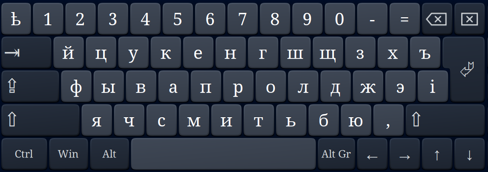
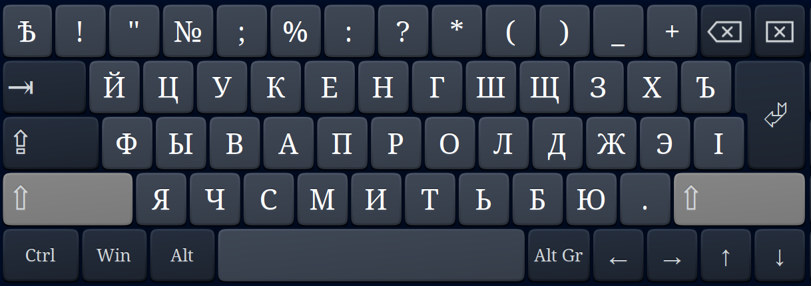
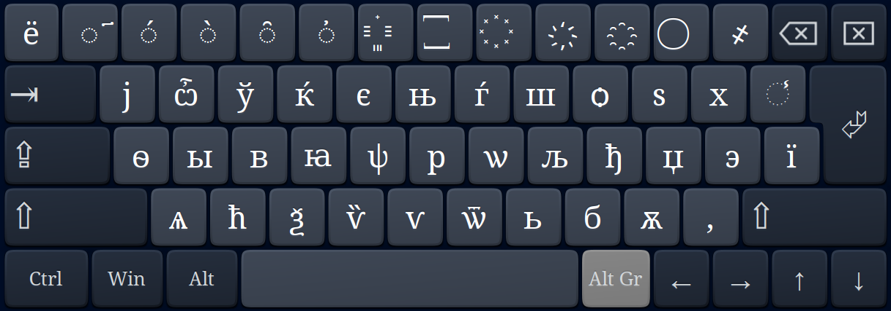
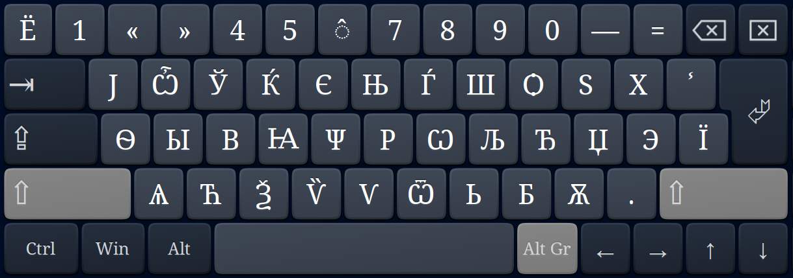

# xkb-ru-old
Russian pre-reform keyboard layout for xkb.

For using place `xkb/symbols/ru@old` to `$HOME/.config/xkb/symbols/ru@old`
and run `xkbcomp $HOME/.config/xkb/symbols/ru@old $DISPLAY`.

You can use various methods for autostarting scripts depending on your
desktop environment, see: https://wiki.archlinux.org/index.php/Autostarting.

`.XCompose` is to be placed to `$HOME/`.

1st level:

2nd level:

3rd level:

4th level:

